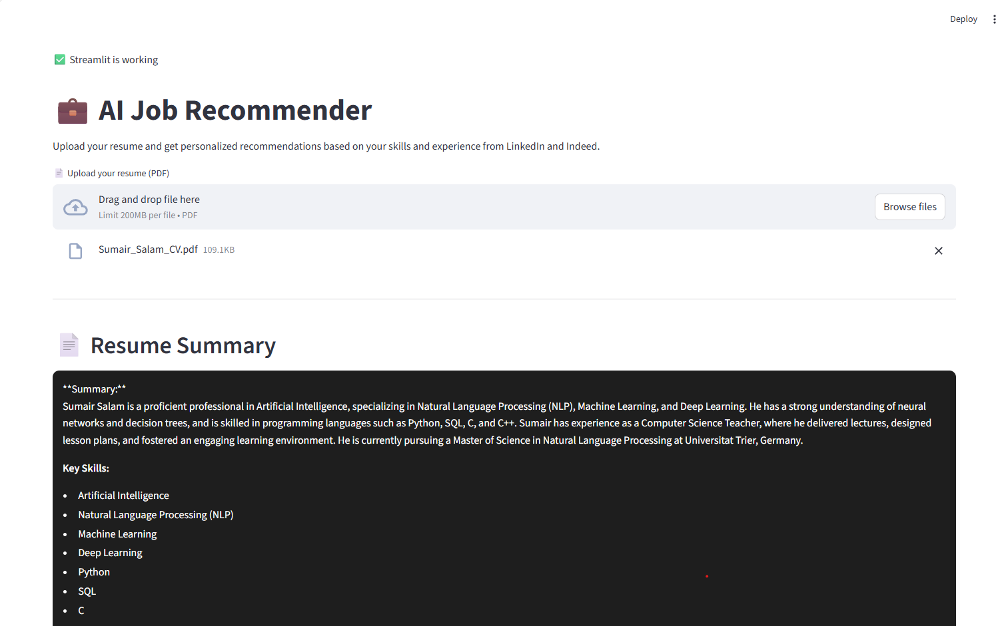
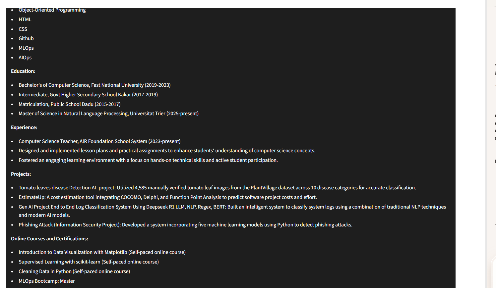
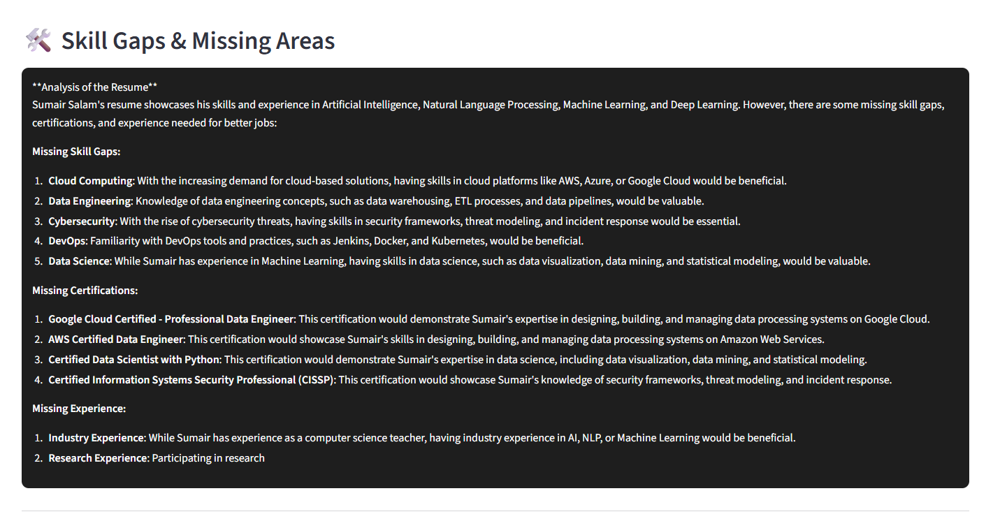
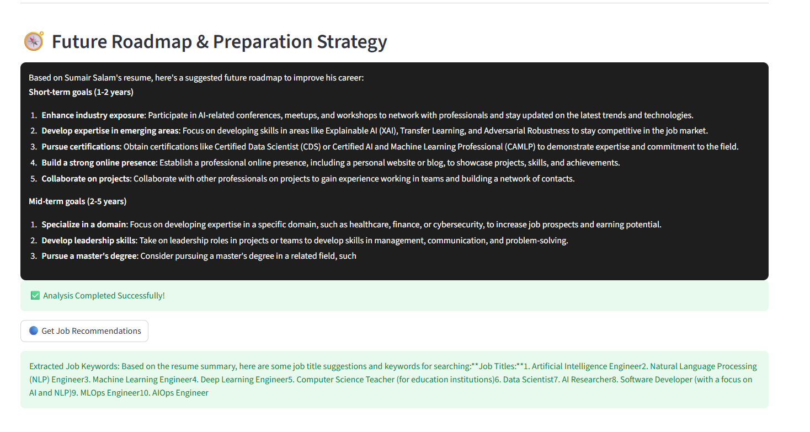

# Job Recommender System 

**AI-powered Streamlit app** that analyzes an uploaded PDF resume, summarizes skills and experience using Groq (Llama), identifies skill gaps and a career roadmap, and fetches personalized job recommendations from LinkedIn and Indeed via Apify actors.

---

##  Project Overview

- Upload a resume (PDF) and extract text using PyMuPDF.
- Use Groq (Llama) chat completions to summarize the resume, recommend keywords, and suggest skill/experience improvements.
- Fetch job listings from LinkedIn and Indeed using Apify actors.
- Simple Streamlit UI for a quick, interactive experience.

---

##  Features

- Resume parsing: `src/helper.py` (PyMuPDF) extracts text from PDFs.
- AI-driven analysis: `src/helper.py` calls Groq/Llama (`ask_openai`) for summary, skill gaps, and roadmap.
- Job search: `src/job_api.py` wraps Apify actors to fetch LinkedIn and Indeed jobs.
- Utilities: `scripts/` contains helper scripts to inspect and validate Apify actor access.

---

##  Requirements

- Python 3.10+ (project lists `requires-python = ">=3.14"` in `pyproject.toml`ensure your local Python matches your environment).
- Recommended packages are listed in `requirements.txt`.

Install dependencies:

```bash
python -m venv .venv
& .\.venv\Scripts\Activate.ps1  # PowerShell
pip install -r requirements.txt
```

---

##  Environment variables

Create a `.env` file in the project root with the following variables (do NOT commit this file):

```env
GROQ_API_KEY=<your_groq_api_key>
APIFY_API_TOKEN=<your_apify_api_token>
# Optional overrides
APIFY_ACTOR_ID=apify/linkedin-jobs-scraper
APIFY_INDEED_ACTOR_ID=apify/indeed-jobs-scraper
```

- `GROQ_API_KEY` is required; the app will raise an error if missing.
- `APIFY_API_TOKEN` is used to authenticate Apify actor runs.

> **Security note:** Never commit your `.env` file or API keys to version control. Consider adding `.env` to `.gitignore`.

---

##  Run the app locally

```bash
streamlit run app.py
```

Flow:
1. Open the Streamlit UI.
2. Upload a PDF resume.
3. The app extracts text, generates a **Resume Summary**, **Skill Gaps**, and **Future Roadmap** via Groq.
4. Click **Get Job Recommendations** to fetch LinkedIn and Indeed jobs for suggested keywords.

---

##  Project structure

```
app.py                  # Streamlit UI
src/
  helper.py             # PDF extraction & Groq LLM wrapper
  job_api.py            # Apify wrappers for LinkedIn/Indeed scrapers
scripts/                # Utilities to inspect / test Apify connectivity
requirements.txt
pyproject.toml
README.md
```

---

##  Screenshots

Below are sequential screenshots of the app (click an image to view the full version):

1. 
2. 
3. 
4. 
5. 
6. 
7. 
8. 

---

##  Notes & Troubleshooting

- Groq/Llama: verify your model name, rate limits and accounts for cost and quotas.
- Apify actors: `src/job_api.py` currently contains actor IDs: replace placeholders with your own if needed.
- If job fetch fails, use `scripts/check_apify.py` and `scripts/list_actors.py` to debug authentication and actor access.
- PDF extraction may miss content for scanned or image-based PDFs (OCR not included).

---

##  Privacy & Data Handling

- The app processes resumes (personal data). Add a retention policy and user consent if deploying publicly.
- Remove API keys and sensitive data from files and logs before sharing the repo.

---

##  Ideas & Next Steps

- Add a `.env.example` file to show required keys without secrets.
- Add caching for job results to reduce costs and speed responses.
- Add tests (unit for helper functions, integration/mocked for `job_api`).
- Add CI checks to ensure `.env` is ignored and linting passes.

---

##  Contributing

PRs welcome. For major changes, open an issue first to discuss your approach.

---

**License:** MIT License

Copyright (c) 2026 sumair salam

Permission is hereby granted, free of charge, to any person obtaining a copy
of this software and associated documentation files (the "Software"), to deal
in the Software without restriction, including without limitation the rights
to use, copy, modify, merge, publish, distribute, sublicense, and/or sell
copies of the Software, and to permit persons to whom the Software is
furnished to do so, subject to the following conditions:

The above copyright notice and this permission notice shall be included in all
copies or substantial portions of the Software.

THE SOFTWARE IS PROVIDED "AS IS", WITHOUT WARRANTY OF ANY KIND, EXPRESS OR
IMPLIED, INCLUDING BUT NOT LIMITED TO THE WARRANTIES OF MERCHANTABILITY,
FITNESS FOR A PARTICULAR PURPOSE AND NONINFRINGEMENT. IN NO EVENT SHALL THE
AUTHORS OR COPYRIGHT HOLDERS BE LIABLE FOR ANY CLAIM, DAMAGES OR OTHER
LIABILITY, WHETHER IN AN ACTION OF CONTRACT, TORT OR OTHERWISE, ARISING FROM,
OUT OF OR IN CONNECTION WITH THE SOFTWARE OR THE USE OR OTHER DEALINGS IN THE
SOFTWARE.

